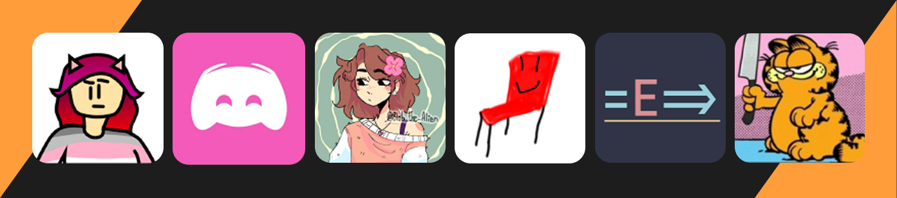

## About
The **Scratch Archival Project** aims to create a digital archive of projects shared on [Scratch](https://scratch.mit.edu/), so that everyone's work can be preserved in the event that something happens to the Scratch website. The archive will be available **for free**, **for everyone**, **forever**.

## Team
Thank you to all our contributors for helping keep SAP running! 🍁🍯

## Contributions
All contributions are welcome! Even if it's as simple as editing this README, we greatly appreciate your support.
